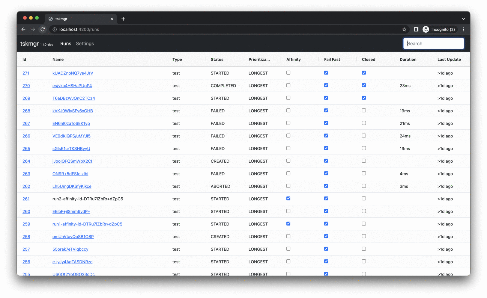

tskmgr (task manager) is a minimalist distributed build system that aims to offer an opensource on-prem installable alternative to Nx Cloud.



## Features

- monitoring dashboard
- task prioritization strategies (longest first, shortest first, FIFO, LIFO)
- leader election
- logging
- dockerized

## Getting Started

### Quick start

To start all necessary containers, use:

```shell
docker-compose -f docker-compose.yml up
```

### Developer environment

#### Prerequisites

- node 22 LTS
- postgres

#### Install

- `git clone`
- install postgres or start postgres docker:  
  `docker-compose -f docker-compose.yml --env-file .env-dev up -d postgres`
- `npm install`
- `npm run start:dev`
- `DEBUG=tskmgr:* npx ts-node --project libs/client/tsconfig.lib.json -r tsconfig-paths/register "libs/client/src/lib/client-example.ts"`
- open browser to `http://localhost:4200`

Check [client-example.ts](./libs/client/src/lib/client-example.ts) for more details.

### Troubleshooting

#### WSL2

You may encounter file permission issues while creating your containers with WSL2.
This has been seen with volume created for `api` to store files.  
To reset permissions use: `chown $USER:$USER ./data/api/files`

## Contribute

Pull requests are welcome! Don't hesitate to open an issue.
