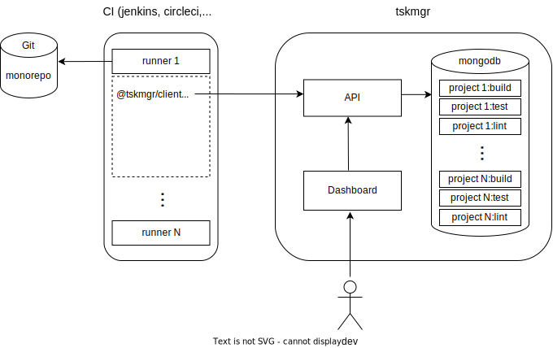

# tskmgr

tskmgr (task manager) is a minimalist distributed task system that aims to offer an opensource on-prem installable alternative to Nx Cloud.

## Features

- monitoring dashboard
- task prioritization strategies (longest first, shortest first, FIFO, LIFO)
- leader election
- runner cache affinity
- dockerized

## Installation

Check [client-example.ts](./libs/client/src/lib/client-example.ts)

## Contribute

Pull requests are welcome! Don't hesitate to open an issue if something goes wrong.
